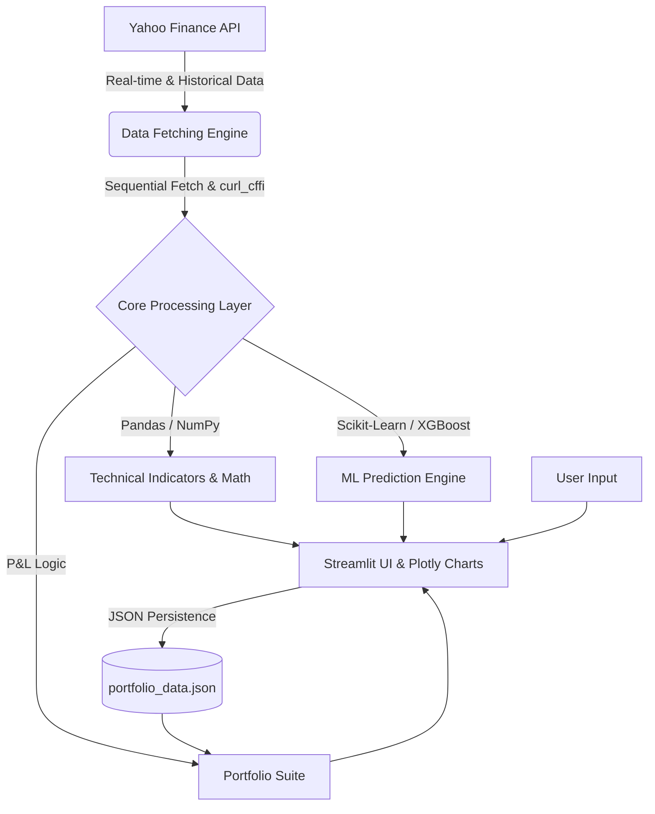

<div align="center">
  <h1>📈 StockFin</h1>
  <h3>The Ultimate Financial Dashboard & AI-Driven Analytics Platform</h3>
  <p>StockFin is a high-performance, dark-themed stock market intelligence dashboard designed for modern traders and investors. Built using Python, Streamlit, and advanced Machine Learning, it provides a seamless experience for real-time market monitoring, deep technical analysis, algorithmic price predictions, and portfolio tracking.</p>

  <p>
    <a href="https://streamlit.io/"></a>
    <a href="https://www.python.org/"></a>
    <a href="https://scikit-learn.org/"></a>
    <a href="https://xgboost.readthedocs.io/"></a>
    <a href="https://plotly.com/python/"></a>
  </p>
</div>

---

## 🌟 Core Modules & Application Pages

StockFin is structured as a multi-page Streamlit application. Each page acts as a dedicated module for a specific aspect of financial analysis.

### 🏠 1. Global Dashboard (`app.py`)
The command center. This is the main entry point of the application.
*   **Live Ticker Grid:** Get an instant view of major indices and your selected favorite stocks with real-time price updates and day-change percentages.
*   **Market Overview:** Features an interactive 3-panel chart displaying Price/Moving Averages, Volume, and RSI (Relative Strength Index) simultaneously.
*   **Fundamental Data & Alerts:** Provides essential company profile data, financial metrics (Market Cap, P/E ratio, Beta), and dynamic alerts (e.g., highlighting unusual trading volume or overbought/oversold RSI conditions).

### 📈 2. Advanced Analytics (`pages/1_Analytics.py`)
A deep-dive technical suite for pattern recognition and advanced charting.
*   **Technical Analysis:** 5-panel interactive charts allowing simultaneous views of Price, RSI, Stochastic oscillators, MACD, and On-Balance Volume (OBV).
*   **Risk Assessment:** Calculates key portfolio risk metrics including Annualized Volatility, Sharpe Ratio, Maximum Drawdown, and VaR (Value at Risk).
*   **Correlation Engine:** Generates dynamic heatmaps showing how different assets move together, which is crucial for portfolio diversification.
*   **Price Levels:** Automatically calculates Fibonacci retracement levels for identifying key support and resistance zones.

### 💼 3. Portfolio Management (`pages/2_Portfolio.py`)
A streamlined tracker for your personal investments.
*   **Holdings Management:** Add, edit, and remove stock holdings dynamically.
*   **Real-Time P&L:** Track your unrealized gains and losses as the market moves based on live data.
*   **Visual Allocation:** Interactive donut charts provide a visual breakdown of your asset allocation and sector distribution.
*   **Persistence:** Securely saves your holdings to a local JSON database (`portfolio_data.json`) so your data is saved between sessions.

### 🤖 4. AI-Powered ML Predictions (`pages/3_ML_Predictions.py`)
Future-casting using state-of-the-art machine learning models trained on historical data.
*   **Multi-Model Support:** Train and compare forecasts from **XGBoost**, **Random Forest**, and **Ridge Regression**.
*   **Dynamic Horizons:** Predict future price movements for flexible 1-day, 7-day, or 30-day windows.
*   **Training Visualization:** View how the models are fitting the historical data in real-time alongside their future forecasted trajectories to gauge model accuracy.

### 🔔 5. Watchlist & Alerts (`pages/4_Watchlist.py`)
Monitor potential opportunities without committing capital.
*   Add stocks to a dedicated watchlist to keep an eye on their daily movements.
*   Set up specific trigger conditions (e.g., price crosses above a certain moving average).

### 🧪 6. Backtesting Engine (`pages/5_Backtesting.py`)
Validate your trading strategies against historical data before risking real capital.
*   **Preset Strategies:** Test popular strategies like SMA Crossover, RSI Mean Reversion, and Bollinger Breakout.
*   **Performance Benchmarking:** Compare the simulated returns of your chosen strategy against a standard "Buy & Hold" baseline.
*   **Trade Logging:** Generates a detailed, tabular summary of every simulated entry and exit point.

### 🗺️ 7. Sector Heatmap (`pages/6_Heatmap.py`)
A macro-level view of the market.
*   Visualizes the performance of various market sectors (Technology, Healthcare, Finance, etc.) at a glance to identify broader market trends and rotations.

---

## 🏗️ Technical Architecture & Data Flow



### 🛡️ Solving Cloud Deployment Challenges
StockFin is designed to run reliably on cloud platforms (like Streamlit Cloud). It actively bypasses Yahoo Finance rate limits and IP bans by utilizing sequential data fetching, exponential back-off retries, and native `curl_cffi` sessions (via `yfinance >= 0.2.40`) to mimic genuine browser traffic.

---

## 🚀 Installation & Local Development

### Prerequisites
- Python 3.9 or higher
- Git

### Setup Steps
1. **Clone & Enter:**
   ```bash
   git clone https://github.com/baibhavoraon377-byte/StockFin.git
   cd StockFin
   ```

2. **Environment Setup:**
   ```bash
   python -m venv .venv
   # Windows:
   .venv\Scripts\activate
   # macOS/Linux:
   source .venv/bin/activate
   ```

3. **Install Core Dependencies:**
   ```bash
   pip install -r requirements.txt
   ```

4. **Launch Application:**
   ```bash
   streamlit run app.py
   ```

---

## 🔒 Disclaimer
**Not Financial Advice.** StockFin is an analytical tool built for educational and research purposes. Stock market trading involves significant risk. Always perform your own due diligence or consult with a certified financial advisor before making any investment decisions.

---
<div align="center">
  Built with ❤️ for the Trading Community
</div>
