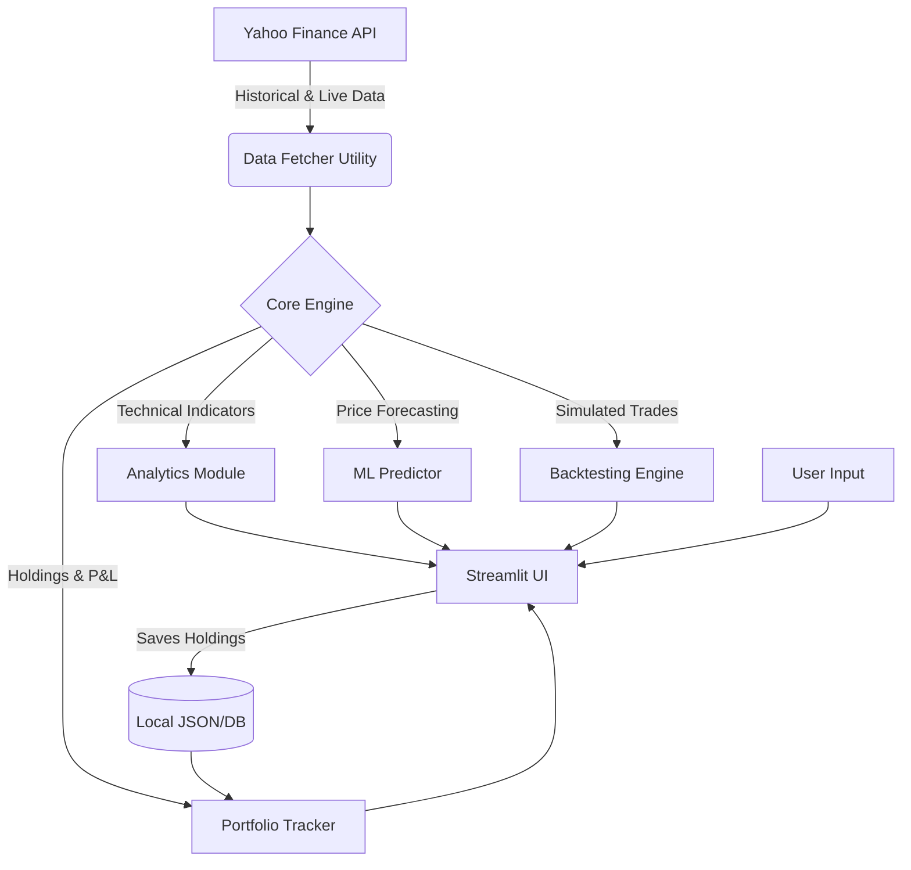

<div align="center">
  <h1>📈 StockFin</h1>
  <h3>Live Market Dashboard & AI Analytics Platform</h3>
  <p>A premium, dark-themed stock analytics platform built with Streamlit, yfinance, and scikit-learn. Real-time quotes, technical analysis, ML price forecasting, portfolio tracking, backtesting, and price alerts — all in one place.</p>

  <p>
    <a href="https://streamlit.io/"></a>
    <a href="https://www.python.org/"></a>
    <a href="https://scikit-learn.org/"></a>
    <a href="https://xgboost.readthedocs.io/"></a>
  </p>
</div>

---

## 🚀 Features at a Glance

✨ **Premium UI/UX:** Dark-mode glassmorphism design with responsive elements.  
⏱️ **Real-Time Data:** Live quotes and intraday charts updated instantly via `yfinance`.  
🧠 **AI Predictions:** Future price forecasting using **XGBoost** & **Random Forest** algorithms.  
📊 **Advanced Technicals:** SMA, EMA, MACD, RSI, Bollinger Bands, Fibonacci Retracements, and more.  
💼 **Portfolio Management:** Track holdings, real-time P&L, allocation pie charts, and risk analysis.  
🧪 **Strategy Backtesting:** Simulate trading strategies on historical data to evaluate performance.  
🔔 **Smart Alerts:** Session-based customizable alerts for price, RSI, and volume breakouts.

---

## 🏗️ Architecture & Workflow

Here is how StockFin processes data and delivers insights:



---

## 📁 Project Structure

This is the recommended structure for your GitHub repository:

```text
stockfin/
├── .github/                    # GitHub Actions workflows (optional)
├── .streamlit/                 # Streamlit theme & config overrides
├── data/
│   └── portfolio_data.json     # Persisted portfolio holdings (add to .gitignore if private)
├── pages/
│   ├── 1_Analytics.py          # Advanced technical & risk analytics
│   ├── 2_Portfolio.py          # Portfolio tracker & P&L
│   ├── 3_ML_Predictions.py     # Machine-learning price forecasting
│   ├── 4_Watchlist.py          # Live watchlist + price alerts
│   └── 5_Backtesting.py        # Strategy backtesting engine
├── utils/
│   ├── __init__.py
│   ├── indicators.py           # Technical Indicators class
│   ├── stock_constants.py      # Shared stock dictionary & helpers
│   ├── stock_data.py           # Data fetching and caching
│   └── styling.py              # Dashboard styling components
├── .gitignore                  # Files to ignore in git (e.g., .venv, __pycache__)
├── app.py                      # Main entry point (Dashboard)
├── requirements.txt            # Python dependencies
└── README.md                   # This file!
```

---

## 🛠️ Quick Start Guide

Follow these steps to run the application locally.

### 1. Clone the repository
```bash
git clone https://github.com/your-username/stockfin.git
cd stockfin
```

### 2. Create a virtual environment
*Creating an isolated environment is highly recommended.*
```bash
python -m venv .venv

# On Windows:
.venv\Scripts\activate

# On macOS/Linux:
source .venv/bin/activate
```

### 3. Install dependencies
```bash
pip install -r requirements.txt
```
> **Tip:** XGBoost is recommended for the best ML predictions, but the app gracefully falls back to Random Forest if it is not installed.

### 4. Launch the application
```bash
streamlit run app.py
```
*The app will automatically open in your default browser at `http://localhost:8501`.*

---

## 📖 Page-by-Page Overview

<details>
<summary><b>1. 🏠 Dashboard (app.py)</b></summary>
The main landing page. Get a quick bird's-eye view of the market with a live ticker grid and an interactive candlestick chart. View fundamental company info, AI signals, and a summary of your portfolio.
</details>

<details>
<summary><b>2. 📈 Analytics</b></summary>
Deep-dive into technicals for a single stock. Features a 5-panel comprehensive chart, risk metrics (Sharpe, Max Drawdown), correlation heatmaps, and automatic support/resistance levels.
</details>

<details>
<summary><b>3. 💼 Portfolio</b></summary>
Track your personal holdings. Add stocks via a dropdown, view real-time P&L, allocation percentages, and analyze portfolio-level risk metrics.
</details>

<details>
<summary><b>4. 🤖 ML Predictions</b></summary>
Leverage machine learning to forecast future prices. Compare XGBoost, Random Forest, and Ridge Regression models over customizable prediction horizons (up to 30 days out).
</details>

<details>
<summary><b>5. ⏱️ Watchlist & Alerts</b></summary>
Monitor multiple symbols simultaneously with mini-sparkline charts. Set up session-based conditional alerts (e.g., "Alert me if RSI goes above 70" or "If price drops by 5%").
</details>

<details>
<summary><b>6. 🧪 Backtesting</b></summary>
Simulate traditional trading strategies (SMA Crossover, RSI Mean Reversion, Bollinger Breakouts) against historical data to see how they would have performed compared to a simple "Buy and Hold".
</details>

---

## 🌐 Publishing to GitHub

To push this project to GitHub, follow these steps in your terminal:

1. **Initialize Git:**
   ```bash
   git init
   ```
2. **Rename your ignore file (if needed):**
   Make sure `gitignore.txt` is renamed to `.gitignore`.
   ```bash
   # On Windows PowerShell:
   Rename-Item -Path gitignore.txt -NewName .gitignore
   ```
3. **Stage and Commit:**
   ```bash
   git add .
   git commit -m "Initial commit: StockFin application"
   ```
4. **Link to GitHub & Push:**
   Go to GitHub, create a new empty repository named `stockfin`. Then run:
   ```bash
   git branch -M main
   git remote add origin https://github.com/your-username/stockfin.git
   git push -u origin main
   ```

---

## 🔮 Roadmap

- [ ] Add real-time news sentiment analysis via API.
- [ ] Implement persistent database storage (PostgreSQL/SQLite) for portfolios.
- [ ] Add user authentication (Streamlit-Authenticator).
- [ ] Containerize with Docker for easy deployment.
- [ ] "Phase 3" - Implement the Floating AI Financial Analyst chat widget.

---

> **Disclaimer:** This application is built for educational and research purposes only. It does not constitute financial advice. Always do your own research before making investment decisions. Past performance does not guarantee future results.
