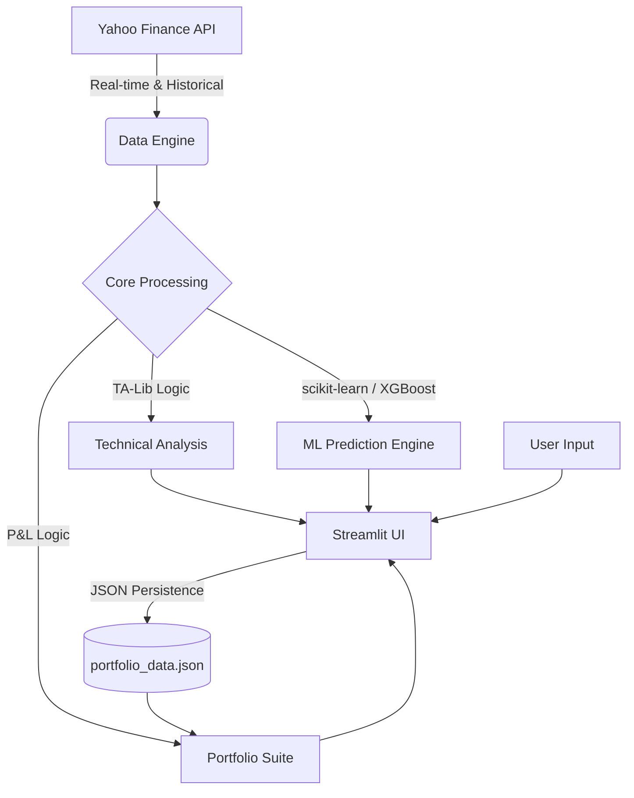

<div align="center">
  <h1>📈 StockFin</h1>
  <h3>The Ultimate Financial Dashboard & AI-Driven Analytics Platform</h3>
  <p>StockFin is a high-performance, dark-themed stock market intelligence dashboard designed for modern traders and investors. Built using Python, Streamlit, and advanced Machine Learning, it provides a seamless experience for real-time market monitoring, deep technical analysis, and portfolio tracking.</p>

  <p>
    <a href="https://streamlit.io/"></a>
    <a href="https://www.python.org/"></a>
    <a href="https://scikit-learn.org/"></a>
    <a href="https://xgboost.readthedocs.io/"></a>
    <a href="https://plotly.com/python/"></a>
  </p>
</div>

---

## 🌟 Core Modules

### 🏠 Global Dashboard (`app.py`)
The command center. Get an instant view of major indices and your favorite stocks via a live ticker grid. Features an interactive main chart with real-time price updates, fundamental company data, and a summary of your portfolio's current health.

### 📈 Advanced Analytics
A deep-dive technical suite. Features include:
- **5-Panel Interactive Charts:** Simultaneous view of Price/MAs, RSI, Stochastic, MACD, and OBV.
- **Pattern Detection:** Automated identification of Double Tops, Head & Shoulders, and Bull Flags using price action algorithms.
- **Risk Assessment:** Key performance metrics like Sharpe Ratio, Maximum Drawdown, and Beta.
- **Correlation Engine:** Dynamic heatmap showing how different assets move together.
- **Price Levels:** Fibonacci retracement analysis for identifying key support and resistance zones.

### 💼 Portfolio Management
A streamlined tracker for your investments.
- **Real-Time P&L:** Track your unrealized gains and losses as the market moves.
- **Sector Allocation:** Automatic breakdown of your exposure by industry.
- **Diversification Analysis:** Visual feedback on your portfolio concentration and risk profile.
- **Persistence:** Securely saves your holdings to a local JSON database.

### 🤖 AI-Powered Price Predictions
Future-casting using state-of-the-art ML models.
- **Multi-Model Support:** Compare forecasts from **XGBoost**, **Random Forest**, and **Ridge Regression**.
- **Dynamic Horizons:** Predict price movements for 1-day, 7-day, or 30-day windows.
- **Training Visualization:** View how models are fitting the data in real-time.

### 🧪 Backtesting Engine
Validate your trading strategies before risking capital.
- **Preset Strategies:** SMA Crossover, RSI Mean Reversion, and Bollinger Breakout.
- **Performance Benchmarking:** Compare strategy returns against a "Buy & Hold" baseline.
- **Trade Logging:** Detailed summary of every simulated entry and exit.

---

## 🏗️ Technical Architecture



---

## 🚀 Installation & Local Development

### Prerequisites
- Python 3.9 or higher
- Git

### Setup Steps
1. **Clone & Enter:**
   ```bash
   git clone https://github.com/baibhavoraon377-byte/StockFin.git
   cd StockFin
   ```

2. **Environment Setup:**
   ```bash
   python -m venv .venv
   # Windows:
   .venv\Scripts\activate
   # macOS/Linux:
   source .venv/bin/activate
   ```

3. **Install Core Dependencies:**
   ```bash
   pip install -r requirements.txt
   ```

4. **Launch Application:**
   ```bash
   streamlit run app.py
   ```

---

## 📁 Repository Map
- `app.py`: Main entry point and global dashboard.
- `pages/`: Individual specialized modules for Analytics, Portfolio, ML, etc.
- `utils/`: Reusable logic for data fetching, indicator calculation, and premium styling.
- `data/`: Local storage for portfolio persistence.

---

## 🔒 Disclaimer
**Not Financial Advice.** StockFin is an analytical tool built for educational and research purposes. Stock market trading involves significant risk. Always perform your own due diligence or consult with a certified financial advisor before making any investment decisions.

---
<div align="center">
  Built with ❤️ for the Trading Community
</div>
